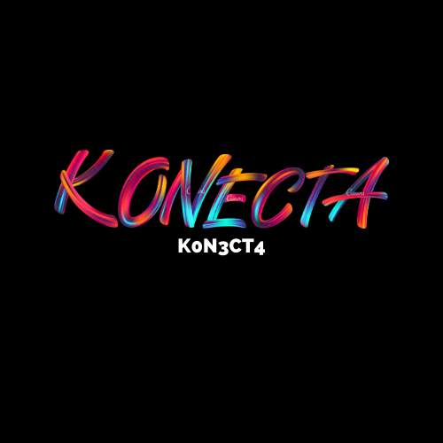

# KoNeCTa

## Table of Content
- [KoNeCTa-Grupo2](#konecta)
- [Table of Content](#table-of-content)
- [Description](#description)
- [In Development](#in-development)
- [Technologies](#technologies)
- [Contributors](#contributors)

## Description
El proyecto surge a partir de una consigna: ¿Cómo relacionar a los adolescentes y la cultura? Esto nos ha llevado a pensar diferentes formas de acercar a los adolescentes, con sus necesidades y restricciones, a la cultura.

Es por esto que decidimos crear una applicación especifica para que los adolescentes encuentren aquello que les gusta, que sea práctica y sencilla, y que brinde una solución a un problema que trae de cabeza a todos los padres y educadores.

El proyecto reunirá información de eventos culturales gratuitos del "underground" (descripción, tipo de evento, horario y lugar). Estos eventos se muestran en dos formatos, un listado con todos los detalles y también en un mapa. Tanto el listado como el mapa, permiten a los usuarios filtrar el contenido para poder encontrar de manera rápida y sencilla el evento que se ajuste a sus necesidades. Estos filtros pueden ser personalizados a la hora de crear un usuario al completar los campos de intereses.

A su vez, los usuarios pueden interactuar entre ellos, ver los eventos a los que asistirán sus amigos y pueden desbloquear recompenzas por participar en la comunidad comentando y calificando eventos a los que han asistido.

## In Development
La aplicación aún se encuentra en su fase de desarrollo. 
Funcionalidades pendientes de agregar:
- Asistencia a eventos.
- Interacción entre usuarios.
- Mapa funcional.
- Sistema de recompensas (Tokens).

## Technologies
Las tecnologias utilizadas:
- HTML
- CSS
- Javascript
- Bootstrap

## Contributors
- Ignacio Albiol
- Carles 
- Ingrid Barrachina
- Anthony Torres